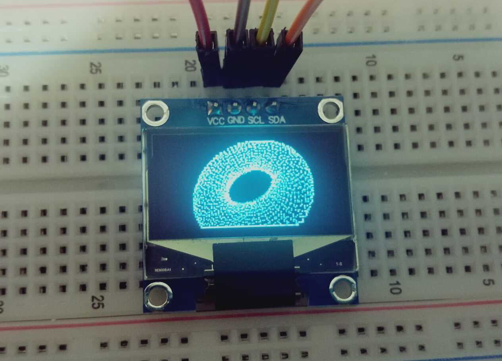
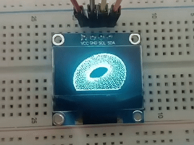

# rp-donut.rs

It shows a spinning donut on an SSD1306 OLED screen using a Raspberry Pi Pico, written in Rust.



Follow to requirements [here](https://github.com/rp-rs/rp2040-project-template) to run the project.

```bash
$ cargo run --release
```


